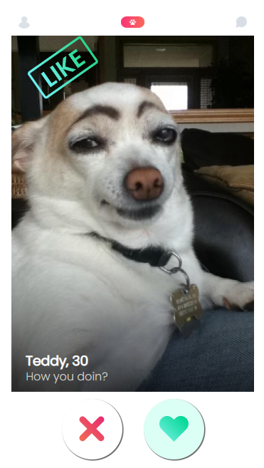
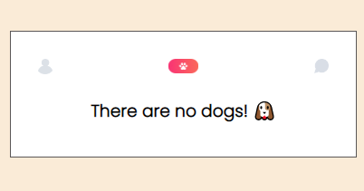

## Table of contents

- [Overview](#overview)

- [Projects](#projects)

  - [1-Role Playing Game](#nft-site)

  ## Overview

  Completed these projects that are parts of [Scrimba](https://scrimba.com/learn/frontend/)'s Next-Level Javascript Module. I mastered HTML/CSS, responsive design and advanced Javascript concepts in these projects.
  You can see the visual representations of the each app below.

  ## Projects

  ### 1-Role Playing Game: [Live Link](https://scrimba-role-playing-game.netlify.app/)
  
  
  ### Visual Representation of the App;
  
  
  
  ### Description
  
  I created a role playing game using my javascript skills. There are one Wizard and three monsters. If User clicks "Attack" button, the game starts! If you want to play this game, you can click live website link above.

  
  
  ### 2-Tindog App
  
  
  ### Screenshots of the App;
  
  
  
  
  
  
  
  ### Description
  
  I created a tindog app called tinder of dogs using my javascript skills. When user clicks "Reject" or "Accept" buttons, dogs are rejected or accepted and rendered another dog in the html

  ### What I Learned?
  

  - Object destructing
  - .map() method
  - .join() method
  - Array constructor
  - .fill() method
  - Constructor functions
  - Object.assign()
  - .reduce() method
  - Ternary operator
  - Arrow functions
  - setTimeOut()
  - Classes 
